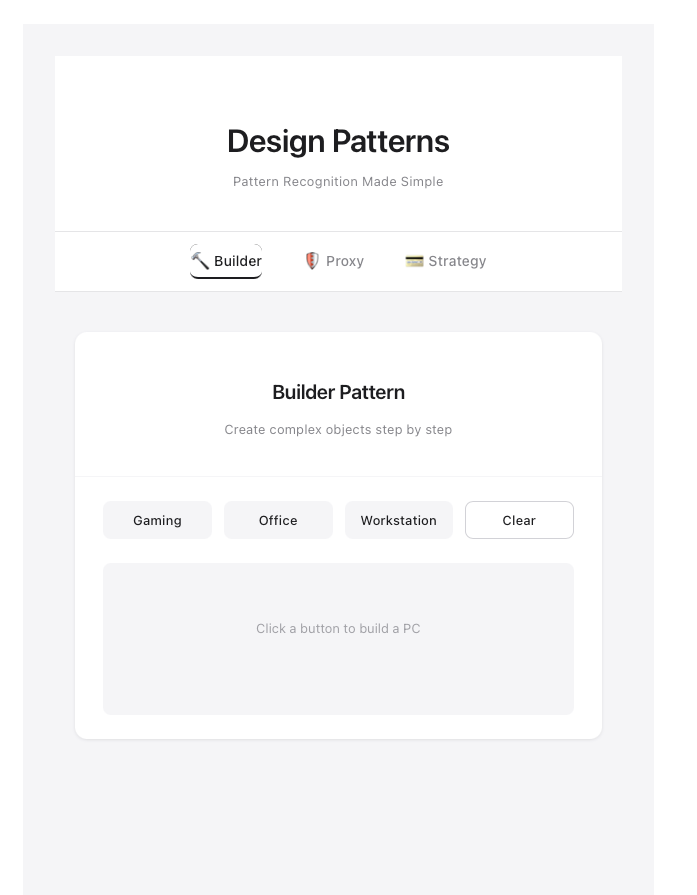
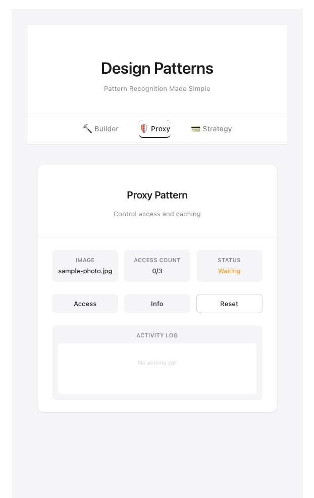
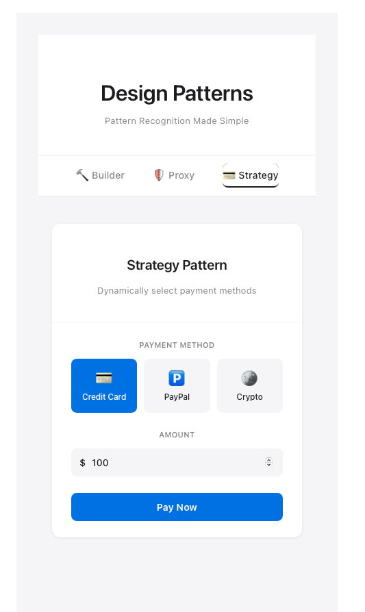

# 디자인 패턴 실습 프로젝트 (실습 3)

Vue 3 + TypeScript를 사용한 객체지향 디자인 패턴 실습 프로젝트입니다.

---

## 📚 목차

- [1. Builder Pattern](#1-builder-pattern-생성-패턴)
- [2. Proxy Pattern](#2-proxy-pattern-구조-패턴)
- [3. Strategy Pattern](#3-strategy-pattern-행위-패턴)
- [설치 및 실행](#설치-및-실행)
- [기술 스택](#기술-스택)

---

## 1. Builder Pattern (생성 패턴)

**설명**: 빌더 패턴은 복잡한 객체의 생성 과정을 단계별로 분리하여, 동일한 생성 과정으로 다양한 표현을 만들 수 있게 해주는 패턴입니다. 객체 생성 시 많은 매개변수가 필요하거나 생성 과정이 복잡할 때 유용합니다.

**구현 내용:**
- 컴퓨터 빌더 예제를 통해 빌더 패턴 구현
- CPU, RAM, Storage, GPU, Monitor를 단계별로 선택하여 컴퓨터 생성
- 메서드 체이닝을 통한 유연한 객체 구성
- 3가지 사전 정의된 컴퓨터 유형 (Gaming, Office, Workstation)

**주요 특징:**
- 단계별 객체 생성으로 가독성 향상
- 필수/선택 매개변수를 명확히 구분 가능
- 불변 객체 생성에 적합

**코드 구조:**
```
Computer (생성될 객체)
  ├── cpu: string
  ├── ram: string
  ├── storage: string
  ├── gpu: string
  └── monitor: string

ComputerBuilder (빌더)
  ├── setCpu(cpu: string): this
  ├── setRam(ram: string): this
  ├── setStorage(storage: string): this
  ├── setGpu(gpu: string): this
  ├── setMonitor(monitor: string): this
  └── build(): Computer
```

**핵심 코드:**
```typescript
// src/patterns/creational/Builder.ts
export class Computer {
  cpu: string = '';
  ram: string = '';
  storage: string = '';
  gpu: string = '';
  monitor: string = '';
}

export class ComputerBuilder {
  private computer: Computer = new Computer();

  setCpu(cpu: string): this { this.computer.cpu = cpu; return this; }
  setRam(ram: string): this { this.computer.ram = ram; return this; }
  setStorage(storage: string): this { this.computer.storage = storage; return this; }
  setGpu(gpu: string): this { this.computer.gpu = gpu; return this; }
  setMonitor(monitor: string): this { this.computer.monitor = monitor; return this; }
  build(): Computer { return this.computer; }
}
```

**사용 예제:**
```typescript
const gamingPC = new ComputerBuilder()
  .setCpu('Intel i9-13900K')
  .setRam('32GB DDR5')
  .setStorage('2TB NVMe SSD')
  .setGpu('RTX 4090')
  .setMonitor('4K 144Hz')
  .build();
```

**UI 기능:**
- 3가지 PC 유형 빌드 버튼 (Gaming, Office, Workstation)
- 빌드된 PC 정보 리스트 표시
- Clear 버튼으로 결과 초기화

**실행 화면:**



---

## 2. Proxy Pattern (구조 패턴)

**설명**: 프록시 패턴은 실제 객체 대신 대리 객체(Proxy)를 사용하여 객체에 대한 접근을 제어합니다. 지연 로딩, 접근 제어, 캐싱 등을 구현할 때 유용합니다.

**구현 내용:**
- 이미지 프록시 예제를 통해 프록시 패턴 구현
- 지연 로딩: 첫 접근 시에만 실제 이미지 객체 생성
- 접근 제어: 최대 3회까지만 접근 허용
- 캐싱: 첫 접근 후 캐시된 객체 사용

**주요 특징:**
- 지연 로딩으로 성능 최적화
- 접근 제어를 통한 보안 강화
- 캐싱으로 중복 로딩 방지
- 인터페이스를 통한 일관된 API 제공

**코드 구조:**
```
ImageInterface (인터페이스)
  ├── display(): void
  └── getInfo(): string

RealImage (실제 객체)
  ├── filename: string
  ├── display(): void
  └── getInfo(): string

ProxyImage (프록시 객체)
  ├── realImage: RealImage | null (지연 로딩)
  ├── accessCount: number (접근 제어)
  ├── display(): void
  ├── getInfo(): string
  └── getAccessCount(): number
```

**핵심 코드:**
```typescript
// src/patterns/structural/Proxy.ts
export interface ImageInterface {
  display(): void;
  getInfo(): string;
}

export class ProxyImage implements ImageInterface {
  private realImage: RealImage | null = null;
  private accessCount: number = 0;
  private maxAccessCount: number = 3;

  display(): void {
    if (this.accessCount >= this.maxAccessCount) {
      console.log('❌ Access denied!');
      return;
    }
    this.accessCount++;
    if (this.realImage === null) {
      this.realImage = new RealImage(this.filename);
    }
    this.realImage.display();
  }
}
```

**사용 예제:**
```typescript
const proxy = new ProxyImage('photo.jpg');

proxy.display(); // 첫 접근: 이미지 생성
proxy.display(); // 캐시 사용
proxy.display(); // 캐시 사용
proxy.display(); // 접근 거부 (최대 3회 초과)
```

**UI 기능:**
- 이미지 접근 제어 (최대 3회)
- 현재 접근 횟수 및 상태 표시
- Access, Info, Reset 버튼
- 활동 로그 표시

**실행 화면:**



---

## 3. Strategy Pattern (행위 패턴)

**설명**: 스트래티지 패턴은 다양한 알고리즘을 캡슐화하여 상호 교환 가능하게 만듭니다. 런타임에 사용할 알고리즘을 선택할 수 있어 코드 유연성이 높아집니다.

**구현 내용:**
- 결제 방식 전략 예제를 통해 스트래티지 패턴 구현
- 신용카드, PayPal, 암호화폐 3가지 결제 방식 지원
- 런타임에 결제 방식 동적 변경 가능
- PaymentProcessor에서 선택된 전략 실행

**주요 특징:**
- 알고리즘의 캡슐화로 코드 분리
- 런타임 동적 선택으로 유연성 증대
- 새로운 전략 추가 시 기존 코드 수정 불필요 (OCP 원칙)
- 조건문 제거로 코드 간결화

**코드 구조:**
```
PaymentStrategy (인터페이스)
  ├── pay(amount: number): void
  └── getPaymentMethod(): string

CreditCardPayment (전략 1)
  ├── cardNumber: string
  ├── cardHolder: string
  ├── pay(): void
  └── getPaymentMethod(): string

PayPalPayment (전략 2)
  ├── email: string
  ├── pay(): void
  └── getPaymentMethod(): string

CryptoPayment (전략 3)
  ├── walletAddress: string
  ├── cryptocurrency: string
  ├── pay(): void
  └── getPaymentMethod(): string

PaymentProcessor (Context)
  ├── strategy: PaymentStrategy
  ├── setPaymentStrategy(): void
  ├── processPayment(): void
  └── getCurrentStrategy(): string
```

**핵심 코드:**
```typescript
// src/patterns/behavioral/Strategy.ts
export interface PaymentStrategy {
  pay(amount: number): void;
  getPaymentMethod(): string;
}

export class PaymentProcessor {
  private strategy: PaymentStrategy | null = null;

  setPaymentStrategy(strategy: PaymentStrategy): void {
    this.strategy = strategy;
  }

  processPayment(amount: number): void {
    if (!this.strategy) return;
    this.strategy.pay(amount);
  }
}
```

**사용 예제:**
```typescript
const processor = new PaymentProcessor();

// 신용카드 결제
const creditCard = new CreditCardPayment('1234-5678-9012-3456', 'John Doe');
processor.setPaymentStrategy(creditCard);
processor.processPayment(100);

// PayPal로 변경
const paypal = new PayPalPayment('user@example.com');
processor.setPaymentStrategy(paypal);
processor.processPayment(50);

// 암호화폐로 변경
const crypto = new CryptoPayment('1A1z7agoat2wSW', 'Bitcoin');
processor.setPaymentStrategy(crypto);
processor.processPayment(0.002);
```

**UI 기능:**
- 3가지 결제 방식 선택 (Credit Card, PayPal, Crypto)
- 금액 입력
- "Pay Now" 버튼으로 결제 처리
- 거래 이력 표시

**실행 화면:**



---

## 설치 및 실행

### 필수 요구사항
- Node.js v14 이상
- npm v6 이상

### 설치
```bash
npm install
```

### 개발 서버 실행
```bash
npm run dev
```

### 프로덕션 빌드
```bash
npm run build
```

---

## 프로젝트 구조

```
src/
├── patterns/
│   ├── creational/
│   │   └── Builder.ts              # Builder 패턴
│   ├── structural/
│   │   └── Proxy.ts                # Proxy 패턴
│   └── behavioral/
│       └── Strategy.ts             # Strategy 패턴
├── components/
│   └── demos/
│       ├── BuilderDemo.vue         # Builder 데모
│       ├── ProxyDemo.vue           # Proxy 데모
│       └── StrategyDemo.vue        # Strategy 데모
├── App.vue                         # 메인 앱
└── main.ts                         # 진입점
```

---